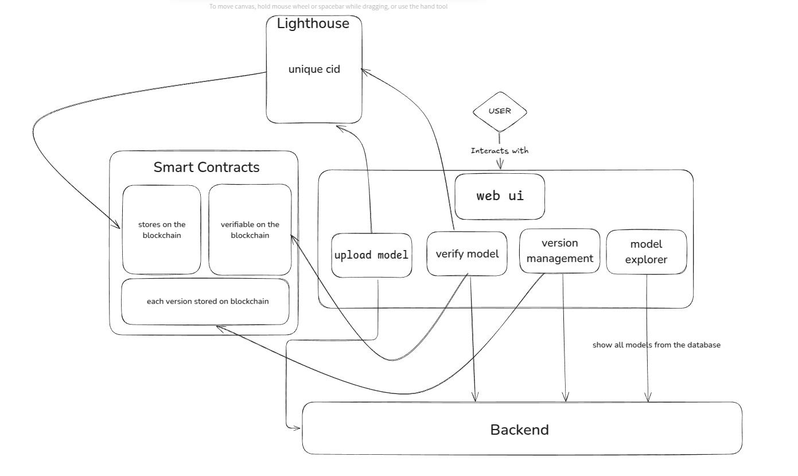

# Everest Model Hub

**Everest Model Hub** is a decentralized platform for sharing, discovering, and using AI models with verified provenance. The platform leverages **Filecoin** blockchain technology to provide secure storage and transparent AI model development.

Here is the Complete Demo: https://youtu.be/0WDYB2XP2ds
---
## **Problem We are trying to Solve:**
If you're an AI researcher or developer who's created a model, you know there's no good way to share your work and get compensated. Your options are either open-source it for free or keep it closed. Plus, tracking versions is a mess, and there's always that worry about someone tampering with your model.

We built Everest Model Hub to fix this. It's a place where creators can share their models, get paid fairly through `FIL` coins(Currently Supporting only `FIL` coins.), and trust that their work remains intact and verifiable.
## Overview

Everest Model Hub allows AI researchers and developers to:

- Upload AI models with proper versioning  
- Store models securely across a distributed network  
- Track changes and maintain version history  
- Verify model provenance and integrity  
- Share and monetize models with flexible licensing options  
- AI Chatbot to help you find models for your niche use cases.

---

## Application Architecture

## Getting Started

### Prerequisites

- Node.js (v18+)  
- `pnpm` package manager  
- MetaMask or compatible Filecoin wallet  

### Installation

**Clone the repository**

```bash
git clone https://github.com/EverestCoders/model-hub.git
cd model-hub
```

**Install dependencies**
```bash
pnpm install
```

**Create a .env file in the root directory with the following variables:**

```env
PORT=3002
JWT_SECRET=your_jwt_secret_key
LIGHTHOUSE_API_KEY=your_lighthouse_api_key
```
**Set up the database**

```bash
pnpm prisma:migrate
pnpm seed
```

**Start the development servers**

```bash
# Start backend server
pnpm dev

# In a separate terminal, start frontend
cd frontend
pnpm dev
```
**Open your browser to** http://localhost:5173 

# Storage and Blockchain Flow

Our platform integrates decentralized storage with blockchain verification in a seamless process:

---

## Model Upload

1. Creator uploads model files and metadata through the UI.
2. Backend processes files and bundles them for storage.
3. Files are uploaded to Filecoin via the Lighthouse API.
4. Two CIDs are generated:
   - `filecoinCid`: for model files
   - `metadataCid`: for metadata

---

## Blockchain Registration
3. Registration transaction is recorded on the blockchain with a `ModelRegistered` event.
1. Model details and CIDs are registered on our smart contract.
2. Contract assigns a unique `modelId` and associates it with the creator's address.

---

## Access Purchase

1. Users can purchase access to paid models via the smart contract.
2. Payment flows directly to the contract, which distributes funds:
   - **98%** to the model creator
   - **2%** to the platform as a fee
---

## Verification Mechanism

- Model integrity is verified by comparing downloaded file hashes with on-chain records.
- Provenance is easily traceable through the blockchain's immutable history.
- Complete version lineage is maintained with parent-child relationships.

---

## Creator Withdrawals

1. Creators can withdraw their earnings directly from the contract.
2. Smart contract transfers funds to the creator's wallet address.


## Future Development 

- Adding the Feature for uploading the  Datasets and verifying them for avoiding copyright issues.
- Incentivizing the original dataset creators.
- To create the entire pipeline so that user can run model using our platform as an API
- Making a SDK to directly interact with our model hub.

